# OctoPrint-Fazenda3D

### Este Plugin do Octoprint é para o projeto [3DFarm](https://github.com/GuilhermeHMFroes/3DFarm).

Esse Plugins estabelece a conexão com o sistema 3DFarm integrando ele a uma fazenda de impressão 3D, onde elle recebe os comando do operador remotamente assim como os arquivos g-code e também realiza em tempo real transmissão de feedback com webcams a fim de garantir uma melhor precisão na operação.

## Instalação

Para poder instalar o plugin siga os seguintes passos:

### Passo 1

Com o Octoprint devidamente instalado, vai em configurações

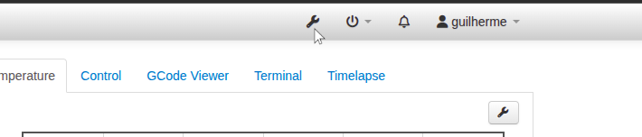

### Passo 2

Vá para a seção Octoprint e depois em Plugin Manager

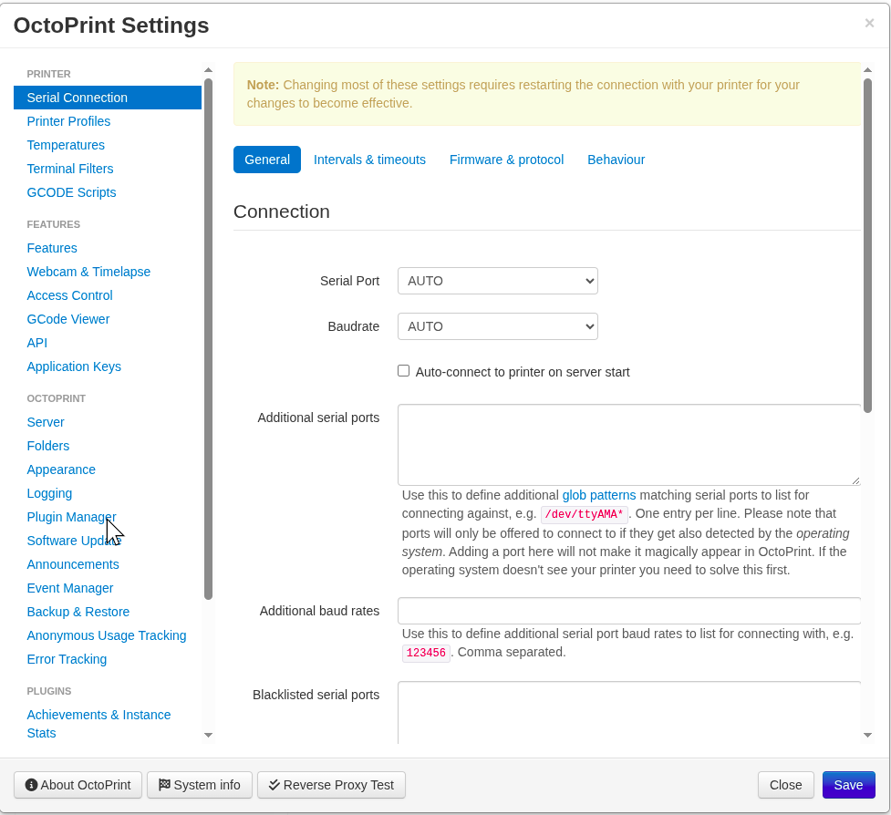

### Passo 3

Na tela do plugin manager clique em get more.

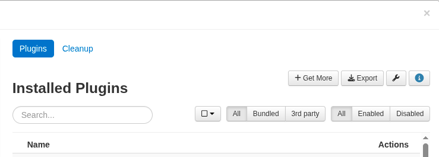

Ele pode te pedir a sua senha se você já estiver a muito tempo logado, é só  digitar a senha novamente e clicarm em confirm.

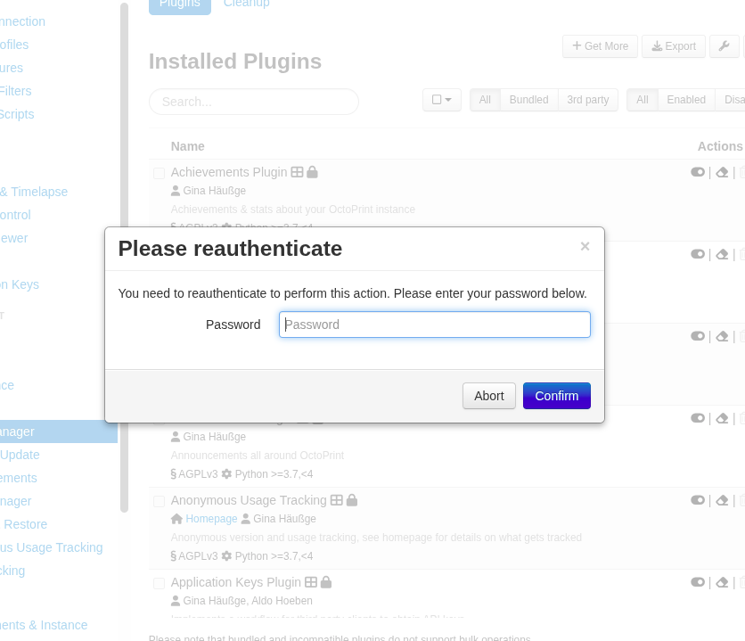

Se for a primeira vez que você instala um plugin ele vai gerar esse alertaa, mas é só clicar em Proceed.

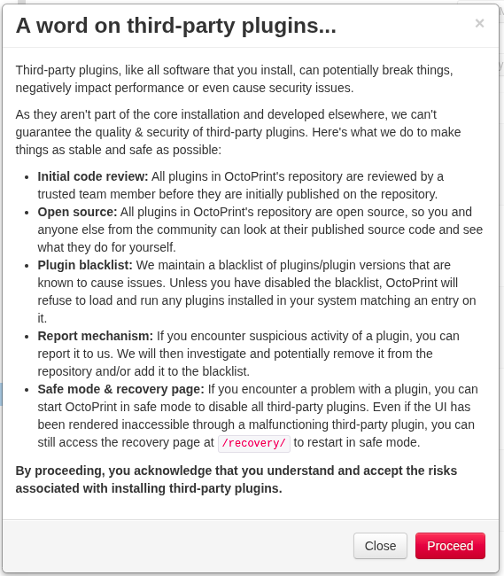

### Passo 4

Agora vai ser realizada a instalação do plugin.

vai em From url e   coloque a seguinte url: 

https://github.com/GuilhermeHMFroes/octoprint-fazenda3d/archive/refs/heads/main.zip 

e depois clique em install.

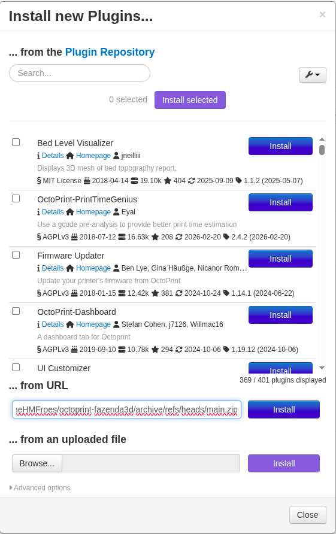

Após clicar em install ele pode pedir a senha novamente, é só digitar e clicar em confirm.

Ele vai começar a instalar o Plugin e só aguarda a instalção

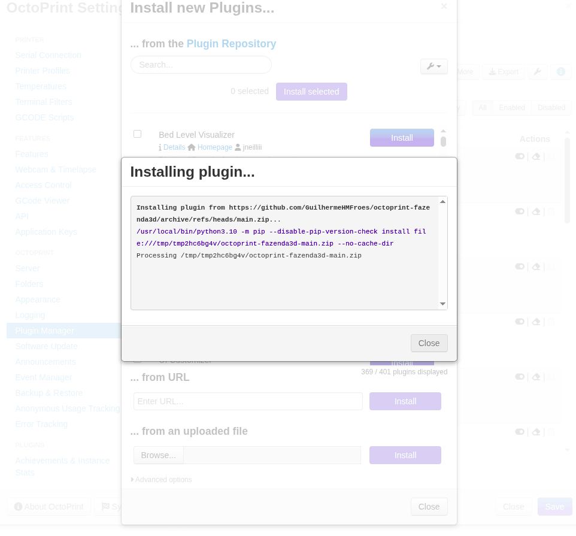

### Passo 5

Após instalar o plugin ele vai pedir para reiniciar o octoprint, mas antes clica em close em todas as janelas e depois reinicie o Octoprint pode clicar em "restart now" no próprio aviso.

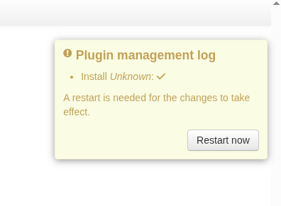

Ele vai perguntar se você realmente quer reiniciar o octoprint, clique em proceed, para reiniciar para garantir a instalação do plugin

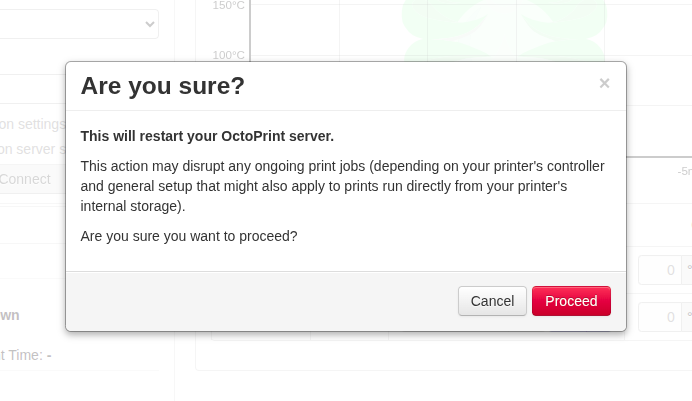

### Passo 6

Seu plugin já está instalado, agora vai nas 4  barrinhas do lado da opção time-lapse e clique na opção Fazenda 3D

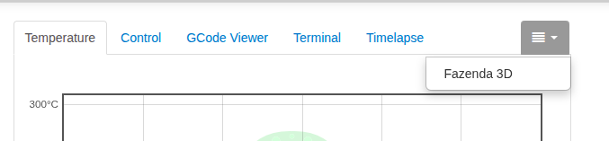

Essa é tela do plugin

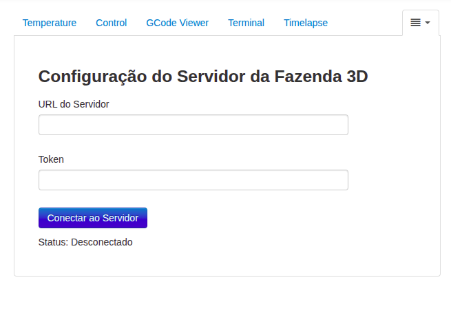

No sistema de fazenda você vai gerar o token e vai copiar esse token no campo token e no campo url você coloca a url do servidor, por exemplo:

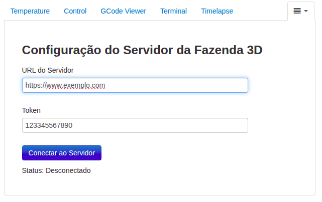

é só  clicar agora em conectar ao servidor e começar a usar
